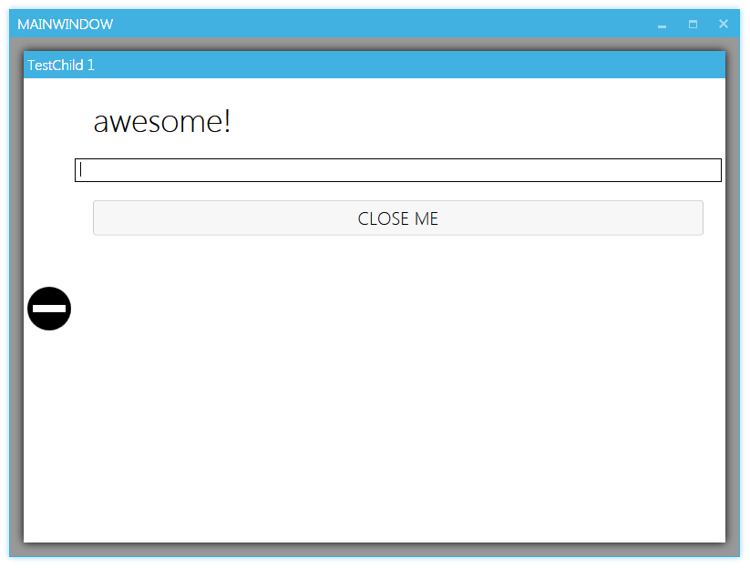
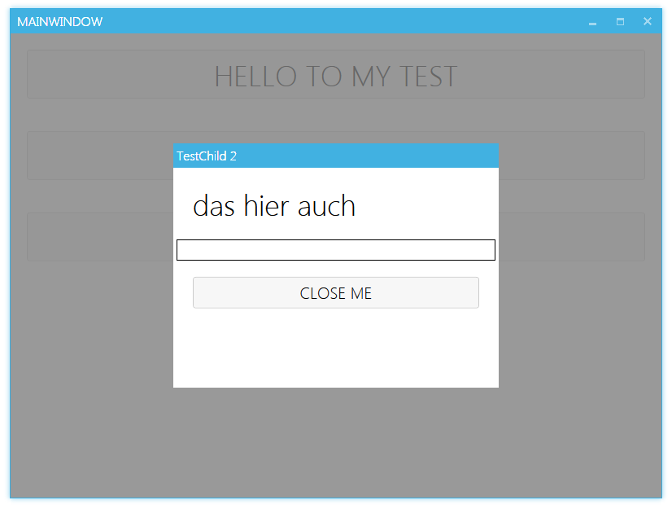
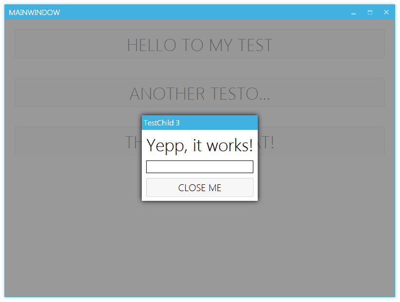
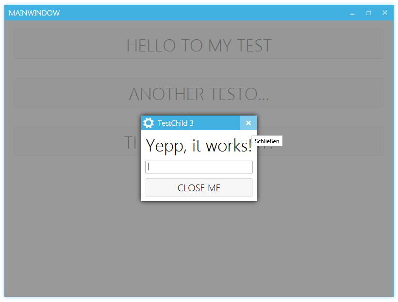

#  MahApps.Metro.SimpleChildWindow

[](https://gitter.im/punker76/MahApps.Metro.SimpleChildWindow?utm_source=badge&utm_medium=badge&utm_campaign=pr-badge&utm_content=badge)

[](https://ci.appveyor.com/project/punker76/mahapps-metro-simplechildwindow/branch/master)
[](https://github.com/punker76/MahApps.Metro.SimpleChildWindow/releases/latest)
[](http://www.nuget.org/packages/MahApps.Metro.SimpleChildWindow/)
[](https://github.com/punker76/MahApps.Metro.SimpleChildWindow/issues)
[](https://twitter.com/punker76)


A simple child window for [MahApps.Metro](https://github.com/MahApps/MahApps.Metro). Yes, this means you need `MahApps.Metro` to use this control.

The dll contains the `ChildWindow` and a helper class `ChildWindowManager`.

**MahApps.Metro.SimpleChildWindow** can be installed via [NuGet](https://www.nuget.org/packages/MahApps.Metro.SimpleChildWindow).

## Want to say thanks?
 * Hit the :star: Star :star: button
 * <a href='https://pledgie.com/campaigns/31038'></a>

### ChildWindow Properties

| Property | Description |
| --- | --- |
| `AllowMove` (`bool` default `false`) | The child window can be moved by the title bar |
| `IsModal` (`bool` default `true`) | The overlay takes the mouse events if an overlay brush exists (by default it is black with an opacity) |
| `OverlayBrush` (`Brush` default `Transparent`) | The brush for the overlay container. The theme defines this to a black solid brush with an opacity |
| `ShowTitleBar` (`bool` default `true`) | Show/hides the title bar |
| `TitleBarHeight` (`int` default `30`) | Sets the title bar height |
| `TitleBarBackground` (`Brush` default `WindowTitleColorBrush` from MahApps.Metro) | The title bar background |
| `TitleForeground` (`Brush` default `IdealForegroundColorBrush` from MahApps.Metro) | The title foreground |
| `Title` (`string`) | The title for the child window |
| `TitleFontSize` (`double` default `WindowTitleFontSize` from MahApps.Metro) | |
| `TitleFontFamily` (`FontFamily` default `HeaderFontFamily` from MahApps.Metro) | |
| `Icon` (`object`) | Defines an icon for the title bar |
| `IconTemplate` (`DataTemplate`) | Defines a template for the `Icon` or something else |
| `ShowCloseButton` (`bool` default `false`) | Show a close button on the title bar |
| `CloseOnOverlay` (`bool` default `false`) | If set to `true` the `ChildWindow` can be closed by clicking on the overlay. |
| `CloseByEscape` (`bool` default `true`) | If set to `true` the `ChildWindow` can be closed by the Escape key. |
| `CloseButtonStyle` (`Style` default `MetroWindowButtonStyle` from MahApps.Metro) | Defines the style for the close button |
| `CloseButtonCommand` (`ICommand`) | Defines a command for the close button. This command will be only executed if the `Close` method was called. |
| `CloseButtonCommandParameter` (`object`) | Defines a (bindable) parameter for the close button command |
| `IsOpen` (`bool`) | Show or closes the child window |
| `ChildWindowWidth` (`double`) | Defines the width for the child window |
| `ChildWindowHeight` (`double`) | Defines the height for the child window |
| `EnableDropShadow` (`bool` default `true`) | Shows a shadow (glow) around the child window |
| `GlowBrush` (`SolidColorBrush` default `Black`) | Defines the glow (shadow) for the child window |
| `BorderBrush` | Defines the brush for the child window border |
| `BorderThickness` |  Defines the border thickness for the child window |
| `FocusedElement` (`FrameworkElement`) | Which element should be focused after open the child window (if no element is defined, the first element will be focused) |
| `AllowFocusElement` (`bool` default `true`) | Defines if the child window should focus an element |
| `VerticalContentAlignment` | Defines the vertical position of the child window |
| `HorizontalContentAlignment` | Defines the horizontal position of the child window |

### ChildWindow Methods

| Method | Description |
| --- | --- |
| `Close()` | Closes the `ChildWindow`. It will also raise the `Closing` event and execute the `CloseButtonCommand`. After all successfully closing stuff the `ClosingFinished` event will be raised.  |

### ChildWindow Events

| Event | Description |
| --- | --- |
| `IsOpenChanged` (RoutedEventHandler) | An event that is raised when `IsOpen` property changes. |
| `Closing` (EventHandler<CancelEventArgs>) | An event that is raised when the `ChildWindow` is closing. |
| `ClosingFinished` (RoutedEventHandler) | An event that is raised when the closing animation has finished. |

### ChildWindowManager

Show a child window with this method.

```csharp
public static Task ShowChildWindowAsync(this MetroWindow window,
                                        ChildWindow dialog,
                                        OverlayFillBehavior overlayFillBehavior = OverlayFillBehavior.WindowContent)
```

- `OverlayFillBehavior` : An enumeration to control the fill behavior of the behavior (full window or only the content)

### Usage

Directly in `XAML`

```xaml
<simpleChildWindow:ChildWindow
                 IsOpen="{Binding IsChildWindowOpenOrNotProperty}"
                 HorizontalContentAlignment="Stretch"
                 VerticalContentAlignment="Stretch"
                 Padding="15"
                 ChildWindowImage="Error"
                 Title="TestChild 1">
  <Grid>
  </Grid>
</simpleChildWindow:ChildWindow>
```

Or with the `ChildWindowManager`

```csharp
private async void OpenAChildWindow_OnButtonClick(object sender, RoutedEventArgs e)
{
  // opens a cool child window
  await this.ShowChildWindowAsync(new CoolChildWindow() { IsModal = false });
}
```

### Stretch with Margin

  

### Without Shadow

  

### AutoSize

  

### With Icon or IconTemplate

  

# License

The MIT License (MIT)

Copyright (c) 2014-2015 Jan Karger

Permission is hereby granted, free of charge, to any person obtaining a copy
of this software and associated documentation files (the "Software"), to deal
in the Software without restriction, including without limitation the rights
to use, copy, modify, merge, publish, distribute, sublicense, and/or sell
copies of the Software, and to permit persons to whom the Software is
furnished to do so, subject to the following conditions:

The above copyright notice and this permission notice shall be included in all
copies or substantial portions of the Software.

THE SOFTWARE IS PROVIDED "AS IS", WITHOUT WARRANTY OF ANY KIND, EXPRESS OR
IMPLIED, INCLUDING BUT NOT LIMITED TO THE WARRANTIES OF MERCHANTABILITY,
FITNESS FOR A PARTICULAR PURPOSE AND NONINFRINGEMENT. IN NO EVENT SHALL THE
AUTHORS OR COPYRIGHT HOLDERS BE LIABLE FOR ANY CLAIM, DAMAGES OR OTHER
LIABILITY, WHETHER IN AN ACTION OF CONTRACT, TORT OR OTHERWISE, ARISING FROM,
OUT OF OR IN CONNECTION WITH THE SOFTWARE OR THE USE OR OTHER DEALINGS IN THE
SOFTWARE.
